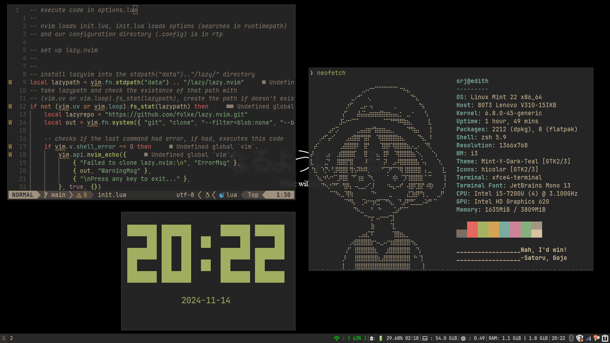

# Dotfiles : Srj-17



# Installing the required apps

# For i3

- Window manager: `i3-wm`
- Status: `i3status` -- downloaded with i3-wm in debian
- Wallpapers are expected from ~/Pictures/wallpapers/ using `nitrogen`
- File manager: `thunar`
- Browser: `firefox`
- Terminal Emulator: `Xfce-4`
- Compositor: `picom`
- `lxappearance` for setting gtk themes
- `qt5ct` for setting qt themes (i've not set this)
- Application Launcher: `rofi`
- Screenshot (with PrtSc): `xfce-4-screenshooter`
- pdf-viewer: `mupdf` & `zathura`
  - zathura-themes: [from here](https://github.com/BeyondMagic/zathura-themes?tab=readme-ov-file)
- image-viewer: `feh`
  - configuration for vim keys from [yudi-matsuzake](https://gist.github.com/yudi-matsuzake/688a6273339cbb2d7a97a53d0d8ab6c7)
- key remapper = keyd
  - config: [keyd_config](./keyd_config) - copy the contents of this to your
    `/etc/keyd/default.conf`
- [xkbswitch](https://github.com/ivanesmantovich/xkbswitch.nvim) for switching layouts (between my local and english language)

## Gtk themes and icons

- gruvbox: [from the great mcpain](https://github.com/TheGreatMcPain/gruvbox-material-gtk)

# Other preferences

- **_Editor_** - Neovim

  - And vscode sometimes -- profile given in EDITH.code-profile

- **_Terminal-Emulator_** - xfce4-terminal
  - gruvbox theme from: [here](https://github.com/xelser/gruvbox-xfce4-terminal)
- **_Terminal Multiplexer_** - tmux
  > [!NOTE]
  > tpm won't work as I've not included ~/.tmux in the dotfiles, so please clone
  > it from the official source as `git clone https://github.com/tmux-plugins/tpm ~/.tmux/plugins/tpm`

# Other apps whose configs are provided

- redshift
- neofetch
- syncthing

# Applying these dotfiles

1. Install stow with your package manager

```bash
sudo apt install stow
```

2. Install git

```bash
sudo apt install git
```

3. make a backup of your current dotfiles directory

```bash
mv ~/dotfiles ~/dotfiles_backup
```

3. Clone the repo in your $HOME directory

```bash
git clone git@github.com:srj-17/.dotfiles.git ~/dotfiles
cd ~/dotfiles
```

4. Stow the files that you need the configurations
   For example:

```bash
stow nvim
```

> As you see here, I used stow to manage all these dotfiles

# How stowing works

```bash
# Package Directory Structure (~/dotfiles/)

~/dotfiles/
├── bash/
│   └── .bashrc
│   └── .bash_aliases
│   └── .bash_profile
├── nvim/
│   └── .config/
│       └── nvim/
│           └── init.lua
│           └── lua/


# Target / Parent Directory (~/) after running 'stow bash' and 'stow nvim'

~/
├── .bashrc                 --> symlink to ~/dotfiles/bash/.bashrc
└── .config/nvim/init.lua   --> symlink to ~/dotfiles/nvim/.config/nvim/init.lua
```

`stow nvim` _stows_ nvim: meaning it creates symlinks for the directories in the nvim
directory in parent directory from where you run the stow command
Here, if you run the `stow nvim` command in ~/dotfiles/ directory, it will create
a symlink for the packages in the parent directory in the same directory structure
as that of your nvim

Basically, it creates symlinks in _parent_ directory by keeping the directory
structure in the _package_ (nvim being the so called _package_) here
